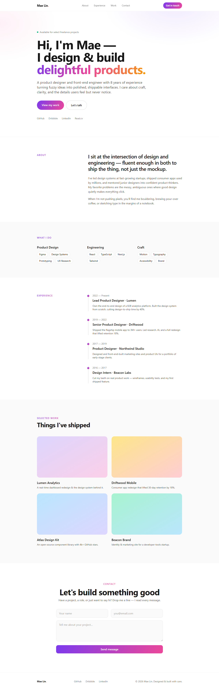

# Free Next.js 15 Personal Portfolio / CV Template — Tailwind CSS, Multi-Page, TypeScript

A clean, minimal personal portfolio and CV starter built with **Next.js 15**, **Tailwind CSS v3**, and **TypeScript**. Deploy to Vercel in minutes and customize the included content from a central config file.

**Live Demo:** [https://free-nextjs-cv-template.vercel.app](https://free-nextjs-cv-template.vercel.app)



[](https://vercel.com/new/clone?repository-url=https://github.com/cekuu35/free-nextjs-cv-template) &nbsp; [](https://free-nextjs-cv-template.vercel.app) &nbsp; [](./LICENSE)

> **Free & MIT-licensed.** Use it for your own portfolio, personal or commercial — no attribution required.
> Need a **business-site starting point**? **[Review all 20 verified demos](https://github.com/cekuu35/nextjs-website-templates#all-20-templates)** or **[get the current $79 bundle on Gumroad](https://cengokurtoglu.gumroad.com/l/vuhstz?utm_source=github&utm_medium=referral&utm_campaign=free_cv_template)**.

---

## Features

- **Multi-page layout** — Home, About, Portfolio, Blog, Contact (each as a dedicated route)
- **Single-file customization** — all content lives in `src/data/config.ts`; no need to hunt through components
- **Contact form scaffold** — client/server validation is included; connect an email provider or database before production delivery
- **Static Site Generation (SSG)** — blazing-fast, zero server cost, deploys perfectly on Vercel / Netlify / GitHub Pages
- **SEO-ready** — per-page `<title>` and `<meta description>` generated from config
- **TypeScript strict mode** — zero `any`, fully typed config
- **Tailwind CSS v3** — utility-first, dark-mode-friendly, easy to restyle
- **Zero JS framework lock-in for content** — swap real CMS data into the typed config shapes when you need to scale
- **Responsive** — mobile-first grid, tested at 375 px → 1440 px
- **Accessibility** — semantic HTML, keyboard navigable, WCAG AA contrast

---

## Quick Start

### 1. Clone

```bash
git clone https://github.com/cekuu35/free-nextjs-cv-template.git my-portfolio
cd my-portfolio
```

### 2. Install

```bash
npm install
```

### 3. Develop

```bash
npm run dev
# Open http://localhost:3000
```

### 4. Deploy to Vercel

[](https://vercel.com/new/clone?repository-url=https://github.com/cekuu35/free-nextjs-cv-template)

Or push to GitHub and import in [vercel.com/new](https://vercel.com/new) — no extra configuration needed.

---

## Customize in One File

Open `src/data/config.ts` and edit the exported constants:

| Constant | What it controls |
|---|---|
| `SITE` | Name, title, tagline, bio, email, location, availability badge |
| `NAV_LINKS` | Top navigation items |
| `SOCIAL_LINKS` | GitHub, LinkedIn, Dribbble, Read.cv, Twitter — add/remove freely |
| `SKILL_GROUPS` | Skill tag groups on the About page |
| `EXPERIENCE` | Work history timeline |
| `EDUCATION` | Education timeline |
| `CERTIFICATIONS` | Optional certifications row |
| `PROJECTS` | Portfolio cards with slug, tags, gradient, live URL |
| `BLOG_POSTS` | Inline markdown blog content with tags and reading time |

Every page reads from this single source of truth — update once, reflect everywhere.

---

## Project Structure

```
src/
  app/
    page.tsx          # Home (hero + featured projects)
    about/            # About, experience, skills, education
    portfolio/        # Project grid + individual project pages
    blog/             # Post list + individual post pages
    contact/          # Contact form (API route at app/api/)
    layout.tsx        # Root layout — NavBar + Footer
  components/
    NavBar.tsx
    Footer.tsx
    ContactForm.tsx
  data/
    config.ts         # ← Edit this file only
```

---

## Tech Stack

| Layer | Choice |
|---|---|
| Framework | Next.js 15 (App Router) |
| Language | TypeScript 5 (strict) |
| Styling | Tailwind CSS v3 |
| Deployment | Vercel (one-click) |
| Node | 18+ |

---

## License

MIT — free for personal and commercial use. See [LICENSE](./LICENSE).

---

## Need a ready-made business site?

This template is a taste of the full collection. If you need an adaptable **business-site starting point for a real project** — not just a personal CV — check out the premium pack:

### 20 Next.js + Tailwind starter templates — current bundle price: $79

Includes complete, deployable sites for:

| # | Template | Type |
|---|---|---|
| 01 | Modern SaaS Landing | SaaS / startup |
| 02 | AI Startup | AI product landing |
| 03 | Digital Agency | Creative agency |
| 04 | Restaurant & Cafe | Food & beverage |
| 05 | Real Estate | Property listings |
| 06 | Fitness & Gym | Health & wellness |
| 07 | E-Commerce Store | Product / shop |
| 08 | Online Course | EdTech / creator |
| 09 | Dental Clinic | Medical / local service |
| 10 | Restaurant Reservation | Booking-focused food |
| 11 | Barber & Salon | Local service |
| 12 | Photography Portfolio | Creative portfolio |
| 13 | Event & Conference | Events / ticketing |
| 14 | Web3 & Crypto | Blockchain / DeFi |
| 15 | Mobile App Landing | App marketing |
| 16 | Newsletter & Creator | Content creator |
| 17 | Hotel Booking | Hospitality |
| 18 | Construction Company | Trade / B2B |
| 19 | Law Firm | Professional services |
| 20 | Personal CV (this one) | Personal / freelance |

The separate bundle contains 20 responsive TypeScript, App Router, and Tailwind CSS starter sites. Review the checkout and included README files for the exact delivered versions, license scope, and integration requirements.

**[Review the clean $79 bundle page](https://cekuu35.github.io/nextjs-template-bundle/)** · **[Get the current $79 bundle on Gumroad](https://cengokurtoglu.gumroad.com/l/vuhstz?utm_source=github&utm_medium=referral&utm_campaign=free_cv_template)**

Full showcase with live demos for all 20 templates:  
**[github.com/cekuu35/nextjs-website-templates](https://github.com/cekuu35/nextjs-website-templates)**

Questions? Open an issue or reach out via the site.
